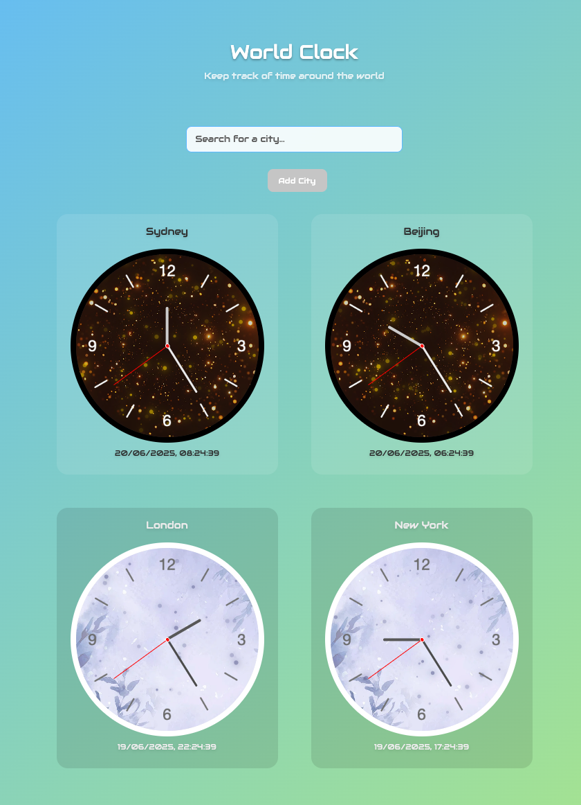

# 🌍 World Clock App

A beautiful, interactive world clock application built with React that allows you to track time across multiple cities around the globe.



## ✨ Features

- **🕐 Real-time Clock Display**: Live analog clocks with hour, minute, and second hands
- **🌆 Multiple Cities**: Track time in multiple cities simultaneously
- **🔍 Smart City Search**: Search and add cities from a comprehensive database of 500+ cities worldwide
- **🎨 Dual Themes**: Toggle between light and dark themes for each individual clock
- **💾 Persistent Storage**: Your selected cities and preferences are saved automatically
- **🌟 Beautiful Animations**: Smooth particle effects and hover animations
- **📱 Responsive Design**: Works seamlessly on desktop and mobile devices
- **🎯 Interactive UI**: Click to toggle themes, hover effects, and intuitive controls

## 🛠️ Technologies Used

- **React 19** - Modern React with hooks and functional components
- **Zustand** - Lightweight state management with Immer for immutable updates
- **Styled Components** - CSS-in-JS styling with theme support
- **React Particles** - Beautiful particle animations
- **Vite** - Fast build tool and development server
- **Custom Font** - Audiowide font for a futuristic look

## 🚀 Getting Started

### Prerequisites

- Node.js (version 16 or higher)
- pnpm, npm, or yarn package manager

### Installation

1. **Clone the repository**

   ```bash
   git clone <repository-url>
   cd world-clock
   ```

2. **Install dependencies**

   ```bash
   pnpm install
   # or
   npm install
   # or
   yarn install
   ```

3. **Start the development server**

   ```bash
   pnpm dev
   # or
   npm run dev
   # or
   yarn dev
   ```

4. **Open your browser**
   Navigate to `http://localhost:5173` to see the app in action!

### Building for Production

```bash
pnpm build
# or
npm run build
# or
yarn build
```

## 🏗️ Project Structure

```
world-clock/
├── public/
│   ├── font/Audiowide/          # Custom font files
│   └── bg-image/                # Background images and clock overlays
├── src/
│   ├── components/              # React components
│   │   ├── City.jsx            # City name display
│   │   ├── CitySearch.jsx      # Search and add cities
│   │   ├── Clock.jsx           # Main clock component
│   │   ├── ClockBoard.jsx      # Clock face with hands
│   │   ├── HourHand.jsx        # Hour hand component
│   │   ├── MinuteHand.jsx      # Minute hand component
│   │   ├── SecondHand.jsx      # Second hand component
│   │   └── Time.jsx            # Digital time display
│   ├── data/
│   │   └── cities.js           # Database of 500+ cities with timezones
│   ├── hooks/
│   │   └── useLocalStorage.js  # Custom localStorage hook
│   ├── store/
│   │   └── useClockStore.js    # Zustand store for state management
│   ├── App.jsx                 # Main app component
│   └── main.jsx               # App entry point
├── index.html                  # HTML template
├── package.json               # Dependencies and scripts
└── README.md                  # This file
```

## 🎮 How to Use

1. **View Default Clocks**: The app starts with 4 default cities (Sydney, Beijing, London, New York)
2. **Add New Cities**:
   - Use the search bar to find cities from around the world
   - Type city name or country to filter results
   - Click "Add City" to add it to your collection
3. **Toggle Themes**: Click the bottom area of any clock to switch between light and dark themes
4. **Remove Cities**: Hover over a clock and click the × button to remove it (minimum 1 clock required)
5. **Real-time Updates**: All clocks update automatically every 200ms for smooth second hand movement

## 🌟 Key Features Explained

### State Management with Zustand

The app uses Zustand for efficient state management:

- Persistent storage of user preferences
- Immutable updates with Immer
- Selective subscriptions for optimal performance

### Time Zone Handling

- Accurate timezone calculations for 500+ cities
- Real-time updates accounting for daylight saving time
- Smooth analog clock animations

### Responsive Design

- Flexible grid layout that adapts to screen size
- Touch-friendly controls for mobile devices
- Optimized performance across devices

## 🎨 Customization

### Adding New Cities

Cities are defined in `src/data/cities.js`. Each city object contains:

```javascript
{
  name: 'City Name',
  timezone: 0, // UTC offset in hours
  country: 'Country Name'
}
```

### Styling

The app uses styled-components with a centralized theme system. Colors and styling can be customized in `src/App.jsx`:

```javascript
const theme = {
	primary: '#69c0ff',
	secondary: '#b7eb8f',
	// ... other theme properties
};
```

## 📱 Browser Support

- Chrome/Chromium (recommended)
- Firefox
- Safari
- Edge

## 🤝 Contributing

1. Fork the repository
2. Create your feature branch (`git checkout -b feature/AmazingFeature`)
3. Commit your changes (`git commit -m 'Add some AmazingFeature'`)
4. Push to the branch (`git push origin feature/AmazingFeature`)
5. Open a Pull Request

## 📄 License

This project is open source and available under the MIT License.

## 🙏 Acknowledgments

- Font: [Audiowide](https://fonts.google.com/specimen/Audiowide) by Astigmatic
- Particle effects powered by [react-particles](https://github.com/matteobruni/tsparticles)
- Icons and styling inspiration from modern design systems

---

Built with ❤️ using React and modern web technologies
